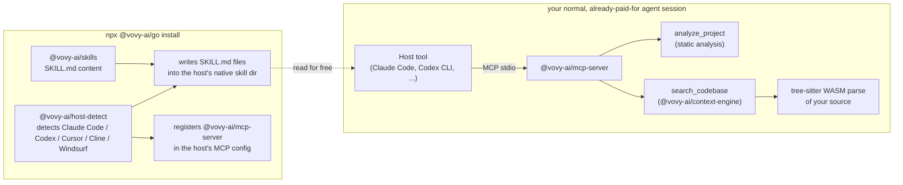

# Vovy CLI

Vovy CLI gives Claude Code, Codex CLI, Cursor, Cline, and Windsurf a small, focused set of skills plus a local MCP server: it scopes vague requests down to something reviewable before any code gets written, finds the exact file or function a request is actually about instead of reading whole files to guess, and explains destructive or high-stakes changes in plain English before they run. It's useful whether you've been shipping code for years or started vibe coding last week — the failure modes it catches (scope creep, wasted context, unreviewed destructive changes) hit both.

It's MIT-licensed and runs entirely on your machine — no account, no API key, nothing phoning home. That's table stakes for a tool that touches your codebase, not the pitch; see [How it works](#how-it-works-for-the-curious) for the actual reason it's built that way.

## 60-second install

```
npx @vovy-ai/go install
```

Vovy detects which AI coding tool you have installed — [Claude Code](https://claude.com/claude-code), [Codex CLI](https://developers.openai.com/codex), [Cursor](https://cursor.com), [Cline](https://cline.bot), or [Windsurf](https://windsurf.com) — and writes its skills there. Your very next prompt gets the benefit.

```
npx @vovy-ai/go doctor       # check everything is installed correctly, see the token footprint
npx @vovy-ai/go uninstall    # remove everything Vovy wrote, cleanly
```

## What it actually does

**Before:** *"add user accounts to my app"* → the AI guesses at scope, builds five things at once, and you have no idea what changed or whether it's safe.

**After Vovy:** the AI stops and rescopes first —

> **Goal:** let people sign up and log in.
> **Building now:** email/password signup + login, nothing else yet.
> **Not doing yet:** password reset, social login, email verification.
> **Assuming:** accounts are private by default — say if that's wrong.

Then it builds *that*, and before anything destructive or high-stakes happens (deleting data, touching auth, installing dependencies, deploying), it explains what's about to happen in plain English before doing it — and checks for the specific security mistakes that showed up in [about 1 in 3 vibe-coded apps deployed publicly](https://www.forbes.com/sites/jodiecook/2026/03/20/vibe-coding-has-a-massive-security-problem/): hardcoded secrets, missing auth checks, overly permissive access.

It also finds the right file before touching it, instead of reading whole files to guess: a deterministic Context Engine (tree-sitter, not embeddings — no AI call involved) locates the exact function, class, or usage site a request is actually about, so the model reads only what's relevant. See [Early performance results](#early-performance-results) for what that's worth in practice.

Vovy ships four skills today:

| Skill | What it does |
|---|---|
| **Prompt Rescoper** | Rewrites vague, oversized requests into a small, reviewable spec before any code is written. |
| **Project Skill Drafter** | Analyzes your actual project (via a deterministic, non-AI tool call — no guessing) and drafts a project-specific skill so future requests already know your stack. |
| **Founder Explainer** | Explains destructive/high-stakes actions in plain English before they happen, and flags common vibe-coding security mistakes. |
| **Context Scoper** | Calls the Context Engine to find the exact symbol or file before reading whole files — fewer tokens spent, fewer same-named false matches. |

Every skill above also works as a typeable command inside Claude Code once installed — `/prompt-rescoper`, `/context-scoper`, and so on. That's a Claude Code platform feature (skills and slash commands are the same mechanism), not something Vovy has to build or maintain separately.

## Architecture



Full breakdown — every package's responsibility, why it's not built on MCP's `sampling` primitive, and the Context Engine's internals — is in [`docs/architecture.md`](docs/architecture.md), including diagrams for the install flow and a tool call end-to-end.

## Early performance results

**Read the disclaimer before the numbers:** this is a small, single-repo, self-measured benchmark (this repo's own source, 10 real "where is X handled" questions) — not an independent audit, not tested against other codebases, and not a measure of whether the model answers correctly, only of how much context it needs to read to try. Full methodology, every query, and the exact numbers are in [`scripts/eval-context-engine/RESULTS.md`](scripts/eval-context-engine/RESULTS.md) — reproduce it yourself with `node scripts/eval-context-engine/run.mjs`, which costs nothing to run (no API key, no network call, pure static measurement).

With that scoping in mind: across those 10 queries, the Context Engine's `search_codebase` returned an average of **~87% fewer estimated tokens** than the whole-file read the same question would otherwise take.

That's one side of the ledger. The other: `npx @vovy-ai/go doctor` reports Vovy's own real "always-on token footprint" — every installed skill file plus every registered MCP tool definition, the tokens a session pays whether or not any of it ever fires — so the cost this adds isn't hidden either.

## FAQ

**Which tools does this work with?** Claude Code and Codex CLI are fully supported today. Cursor, Cline, and Windsurf support is included but best-effort — see [`docs/host-support-matrix.md`](docs/host-support-matrix.md) for exact status, and please open a PR if you can confirm or fix a path.

**What does this actually change on my machine?** A few markdown skill files inside your coding tool's own config directory (e.g. `~/.claude/skills/`), plus one line registering `@vovy-ai/mcp-server` in that tool's MCP config. Run `npx @vovy-ai/go install --dry-run` first to see exactly what would be written before anything happens, `npx @vovy-ai/go doctor` any time to see the real, deterministic token footprint that adds to a session, and `npx @vovy-ai/go uninstall` any time to remove it all.

**Does this cost anything, or send my code anywhere?** No, and no. There are no Vovy servers to send code to, and nothing here holds an API key — it's markdown skill files your existing tool reads with the model you already pay for, plus local, deterministic tooling (static analysis, tree-sitter parsing). Normal for MIT-licensed, local-first tooling; called out explicitly here because it's the reason the architecture looks the way it does, not because it's unusual for open source.

## How it works (for the curious)

MCP has a feature (`sampling`) that would let a server ask the connected client to run a completion on its own model — in theory, exactly what Vovy would need. In practice, no major host tool implements it today, and the next MCP spec revision deprecates it. So Vovy doesn't depend on it. Instead, `npx @vovy-ai/go install` writes skill files directly into each tool's own native skill/rules directory — the same mechanism your tool already uses for its own instructions — so the "thinking" happens for free inside your normal, already-paid-for agent session. The real computation Vovy does — reading your `package.json` and file tree to detect your stack (`analyze_project`), and parsing your source with tree-sitter to answer "where is X" (`search_codebase`) — is plain, deterministic, non-AI function calls, not a hosted service. See [`docs/architecture.md`](docs/architecture.md) for the full picture, including exactly how the Context Engine works and what it deliberately doesn't do yet.

## Contributing

Vovy is MIT-licensed and welcomes contributions — new host adapters especially. See [`CONTRIBUTING.md`](CONTRIBUTING.md).

## License

[MIT](LICENSE)
