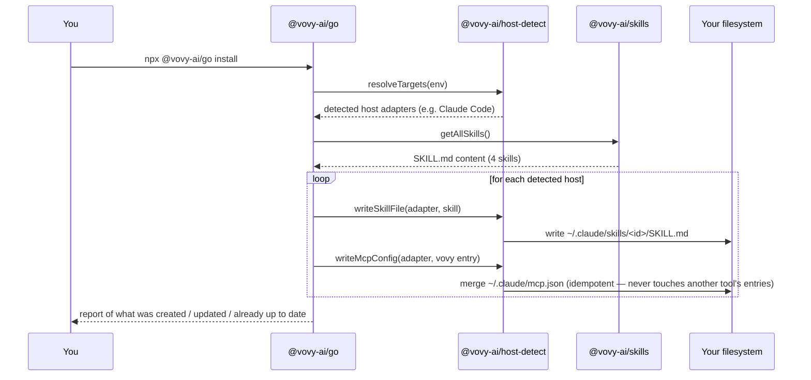
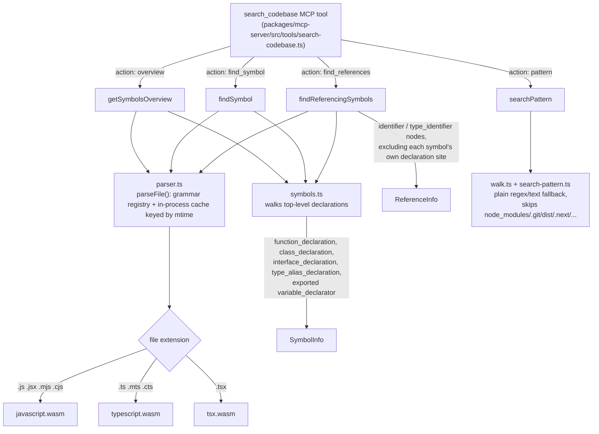
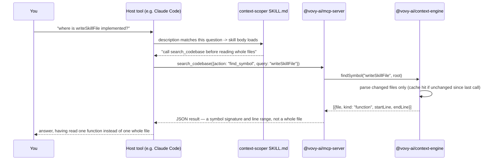

# Architecture

## The hard constraint

Vovy is free forever for both users and the maintainer. That means Vovy must never run its own LLM inference or hold its own API keys/billing. Every piece of "intelligence" has to happen inside the user's own already-paid host-tool session (Claude Code, Codex CLI, Cursor, Cline, Windsurf), not via a Vovy-hosted call.

## Why this isn't built on MCP sampling

MCP has a `sampling/createMessage` primitive that, on paper, does exactly what we need: a server asks the connected client to run a completion on the client's own configured model, no server-side API key required. Two things rule it out as a foundation:

1. **No target host implements it.** As of this writing there are open, unresolved feature requests for it in Claude Code, Codex CLI, and Cursor, and no confirmed support in Cline or Windsurf.
2. **The MCP spec itself is deprecating it** (SEP-2577), explicitly because real-world adoption never happened, and its suggested replacement — "integrate directly with an LLM provider API" — is exactly the thing our free-forever constraint forbids.

## What Vovy actually does instead

Every target host independently converged on a markdown-file convention its own agent loop reads for free: `SKILL.md` for Claude Code and Codex CLI (the shared open "Agent Skills" format), `.mdc` rules for Cursor, flat rule files for Cline and Windsurf. `npx @vovy-ai/go install` writes Vovy's skills directly into whichever of these directories the detected host uses. This is the **primary** delivery mechanism — zero protocol dependency, works today, on every host, using a feature each vendor already built and maintains for their own reasons.

The same content is *also* served by `@vovy-ai/mcp-server` as MCP `prompts` and `resources` (`skill://<id>`) — both still-stable, non-deprecated MCP primitives — as a **secondary**, redundant path for any host with good MCP-prompt discovery UX. Nothing depends on this path working.

`@vovy-ai/mcp-server` additionally exposes deterministic MCP **tools**: `analyze_project` (plain static analysis — read `package.json`, walk the file tree, detect framework/package-manager/test-runner signals, flag a few concrete footguns like an untracked `.env`) and `search_codebase` (deterministic tree-sitter symbol search, see "Context Engine" below). No network calls, no LLM, no guessing, either one. The `project-skill-drafter` skill instructs the host's own model to turn `analyze_project`'s output into a tailored project skill file — this is how "auto-generate a project-specific skill from codebase analysis" works without Vovy running any inference: Vovy supplies facts, the founder's own paid model supplies judgment.

## Package layout

```
packages/
├── skills/          @vovy-ai/skills          — SKILL.md content + typed manifest (single source of truth)
├── host-detect/     @vovy-ai/host-detect     — HostAdapter interface + per-host detect/write logic
├── context-engine/  @vovy-ai/context-engine  — deterministic tree-sitter symbol search, no embeddings
├── mcp-server/      @vovy-ai/mcp-server      — MCP server (stdio); serves analyze_project + search_codebase + prompts/resources
└── cli/             @vovy-ai/go              — `npx @vovy-ai/go install|doctor|uninstall`
```

`@vovy-ai/skills` has zero runtime dependencies and is the actual product content; both `cli` and `mcp-server` import it so the two delivery paths can never drift apart. `@vovy-ai/host-detect` isolates the highest-blast-radius code — writing into other tools' config directories inside `$HOME` — behind a small `HostAdapter` interface, and is the main extension point for adding new hosts (see [`host-support-matrix.md`](host-support-matrix.md) and [`../CONTRIBUTING.md`](../CONTRIBUTING.md)).

## Install flow

What `npx @vovy-ai/go install` actually does, end to end — every step below is a plain function call and a filesystem write, nothing hosted:



`npx @vovy-ai/go doctor` re-runs this same resolution in dry-run mode (see `runInstall({ dryRun: true })` in `packages/cli/src/commands/doctor.ts`) so "would this change anything" and "is this actually installed" can never drift into two separate, inconsistent code paths.

## Context Engine (v0.2 Phase 2)

`@vovy-ai/context-engine` is the real substance behind what used to be a one-line "v0.2+: LSP-based retrieval in the spirit of Serena" aspiration. It answers "where is X handled" / "what calls this function" / "is it safe to change this" style questions with no embeddings, no network calls, and no LLM — the same ethos as `analyze_project`.

It resolves those questions through one of two **backends**, chosen per project root:

| Backend | When it's used | What it can do |
|---|---|---|
| `typescript` | The project has TypeScript resolvable from its root (nearly every JS/TS project does) | Scope- and type-aware. Two same-named symbols in different scopes stay distinct, and every reference names the declaration it resolves to. |
| `tree-sitter` | Everything else — the fallback | Identifier-token matching. Never matches inside a string or comment (a real improvement over grep), but cannot tell two same-named symbols apart. |

- **Why the TypeScript compiler API and not `typescript-language-server`.** The obvious reading of "add LSP backends" is to spawn external language servers. That fails the zero-friction constraint: a founder does not have `typescript-language-server`, `pyright`, or `gopls` on their PATH, and Vovy will not install binaries for them. Instead the backend resolves the *project's own* `typescript` from its `node_modules` and drives `ts.LanguageService` in-process — `getNavigateToItems` for declarations, `getReferencesAtPosition` for usages. Real scope/type awareness, zero install burden, and `typescript` is never a declared runtime dependency of Vovy (see `packages/context-engine/src/backends/load-typescript.ts`). A project without TypeScript degrades to `tree-sitter` rather than erroring.
- **Every result names its backend.** `search_codebase` returns `{ backend, results }`, and `context-scoper` tells the host model to read it: a `tree-sitter` answer is a candidate, a `typescript` answer is resolved. A result that cannot be trusted must say so rather than look identical to one that can.
- **Monorepo source mapping.** A cross-package import resolves through the sibling package's built `dist/index.d.ts`, which the checker treats as a *different symbol* from the one in `src/`. Left alone, `find_references` would silently omit every usage in a sibling package — strictly worse than the grep it replaces, and silently so. `backends/workspace-paths.ts` reads `pnpm-workspace.yaml`/`workspaces` and maps each package name to its source entry point. Verified: without it, `find_references("detect")` misses `packages/cli/src/targets.ts`.
- **Runtime (fallback backend)**: [`web-tree-sitter`](https://www.npmjs.com/package/web-tree-sitter) (WASM, no native build/node-gyp step — a founder's machine never compiles anything to install Vovy) parsing JS/TS/JSX/TSX only for now. Grammar `.wasm` files are sourced once at build time from the (Unlicense) `tree-sitter-wasms` bundle and shipped inside the package — see `packages/context-engine/scripts/copy-wasm-grammars.mjs`.
- **`web-tree-sitter` is deliberately pinned to an older release** (0.20.8, not the current 0.26.x) — verified empirically while building this that newer releases reject these same prebuilt grammar binaries during `Language.load()`. See the comment in `packages/context-engine/src/parser.ts` before bumping this dependency.
- **API**: `getSymbolsOverview`, `findSymbol`, `findReferencingSymbols`, `searchPattern` — naming borrowed from Serena's own symbol-tool taxonomy. Exposed to hosts as one consolidated MCP tool, `search_codebase` (an `action` enum, not four separate tools — every registered tool definition is token overhead paid every session whether or not it's called, so fewer/richer tool definitions is a cost-saving choice in itself, not just a style preference).
- **Members, not just top-level declarations.** Both backends index class methods, interface members, and object-literal methods with their containing symbol. Before this, `getSymbolsOverview` on an adapter file returned one symbol (the adapter object) and `find_references("detect")` returned `[]` — an empty array, indistinguishable from "no references exist", for a method with three real call sites.
- **`context-scoper`** (`packages/skills/skills/context-scoper/`) is the skill that instructs the host model to call `search_codebase` before reading whole files — the actual "better tool-calling via semantic search" behavior, not just a tool sitting unused. See `scripts/eval-context-engine/RESULTS.md` for a reproducible measurement of both the token difference and the correctness difference, scored against hand-verified ground truth.

### Remaining honest limitations

- **JS/TS/JSX/TSX only.** Neither backend understands Python, Go, or Rust.
- **Nothing persists.** Both backends hold their index in-process; it dies with the process.
- **`impact` is reverse-only.** "What breaks if I change X" is answered transitively; "how does A reach B" (forward trace) is not built.



### Tool-call flow, end to end

A concrete trace of what happens when `context-scoper` fires on a real question:



## Project memory (v0.2 Phase 2.1)

`project_memory` (third MCP tool) records **decisions, mistakes, and constraints** as plain markdown under `.vovy/memory/`, committed to git. Git is the entire backend: memory travels with `git clone` into every host Vovy supports, teammates share it free, entries are reviewable in PRs — no account, no server, nothing to meter. The `memory-keeper` skill supplies the trigger behavior (record when the founder corrects an approach, when an attempt fails, when a real choice gets made; recall before non-trivial work), the same tool+skill pairing as `search_codebase`+`context-scoper`.

Design decisions worth knowing:

- **Rationale-first structure.** A `decision` entry must include what was *rejected* and why (the winner is already visible in the code); a `mistake` must include why it happened and how to avoid it; a `constraint` must include the why behind the rule. The most valuable project context is exactly the part that never survives in code.
- **Mechanical first.** When a founder wants something always/never done, the skill's first move is offering a test/lint/CI check — prose memory is the fallback for rules that can't be automated, not the default. (This repo learned that the hard way: a documented cross-file invariant drifted twice in one day until a test pinned it — see `.vovy/memory/mistakes/`.)
- **Recall is deterministic keyword scoring**, not embeddings — computing embeddings is inference, which the free-forever constraint rules out. For the hundreds of entries a project accumulates, word overlap with title/tag weighting is enough.
- **Secrets are refused, not warned about.** Entries are committed to git, where they can end up public; `record` rejects content matching common credential shapes outright.
- This repo dogfoods it: `.vovy/memory/` here holds the real decisions and mistakes from building these features.

`npx @vovy-ai/go statusline` prints a one-line badge (`[vovy] skills 4/4 hosts ok · engine:typescript · memory:4`) for hosts with a status bar; the installer prints the opt-in Claude Code `statusLine` snippet but never edits the founder's settings itself.

## Cost transparency

`npx @vovy-ai/go doctor` reports a deterministic "always-on token footprint" estimate — the chars/4-estimated size of every installed skill file plus every registered MCP tool's name/title/description, the tokens a session pays whether or not a skill ever fires or a tool ever gets called. This is the honest, buildable version of "cost savings": show the real number rather than an unverifiable savings-percentage marketing claim (see `packages/cli/src/commands/doctor.ts`'s `estimateTokens`/`computeTokenFootprint`).

## Roadmap

**Built (v0.2 Phase 1):** tree-sitter Context Engine, `search_codebase`, `context-scoper`, `doctor`'s token-footprint report.

**Built (v0.2 Phase 2):** the `typescript` backend and the `SymbolBackend` seam behind it, member-level symbol recall, monorepo workspace source mapping, backend provenance on every result, structured skill `triggers` with project-context-aware descriptions, and two reproducible benchmarks (`scripts/eval-context-engine`, `scripts/eval-skill-routing`) — all described above.

**Built (v0.2 Phase 2.1):** `search_codebase`'s `impact` action — transitive reverse reachability ("what breaks if I change this"), a BFS over reference edges out to `maxDepth` (default 3) caller hops, each result tagged with its depth and the named declaration enclosing it. The walk continues through *any* named declaration, not just functions — a symbol exposed as an object-literal property (`mergeMcpConfig: mergeJsonMcpConfig`) walks on through the property to the code that calls it, which dogfooding showed would otherwise dead-end at `"<module>"`. On the `typescript` backend every hop is checker-resolved; on `tree-sitter` every hop is a name match, so the deeper the walk the more it can over-report — the response's `backend` field is the reader's cue for how much to trust the tail. Also: `doctor` now reports which backend a directory gets and how to upgrade it, and `scripts/eval-context-engine/latency.mjs` measures cold-start vs warm-query cost (see LATENCY.md for machine-scoped numbers).

**Phase 3, deliberately not built yet:**

- **A persistent index.** Both backends die with the process, so an MCP server restart re-parses everything — `latency.mjs` puts a number on that recurring cold cost. A per-repo on-disk index keyed by git commit, with staleness detection, would fix it. It must serialize to plain files: an embedded graph database would drag in a native module and break zero-friction install.
- **Forward call graph / shortest path** (`trace`: "how does A reach B"). The reverse walk (`impact`) shipped first because "is it safe to change this" is the founder question; forward tracing is a developer-debugging question and can wait for demand.
- **External LSP backends** (`gopls`, `pyright`, `rust-analyzer`) for languages beyond JS/TS. The `SymbolBackend` interface exists for exactly this. Still gated on the same problem that kept it out of Phase 2: a founder does not have these on their PATH, and Vovy will not install binaries on their behalf.
- **Model-tier routing / response caching / tool-output compression** (RouteLLM/GPTCache/LLMLingua-style techniques) — still no hosted endpoint, still local-only if built, just not started yet.
- **Fuzzy retrieval, without a model.** BM25 or a trigram index gets fuzzy symbol lookup deterministically. Local embeddings do not qualify: computing them *is* inference, `onnxruntime-node` is a native module, and the weights are hundreds of megabytes. That path is closed by the free-forever constraint, not merely unbuilt.
- **Curated skill registry / distribution trust layer.**

**A note on prior art.** [GitNexus](https://github.com/abhigyanpatwari/GitNexus) implements much of the Phase 3 graph layer (`impact`, `trace`, confidence-scored edges) and is worth studying. Its LICENSE is **PolyForm Noncommercial 1.0.0** — source-available, not open source, and GitHub's API reports its SPDX id as `NOASSERTION`. Study the design; never copy the code. Its `typescript`-grade resolution quality is a documentation claim with no published benchmark behind it, and its CLI depends on native modules (`@ladybugdb/core`, native tree-sitter, optionally `onnxruntime-node`) that Vovy's install constraints rule out.

**Still true, and still a deliberate choice, not an oversight:** no telemetry of any kind in the free-forever core — a telemetry backend implies infrastructure cost, which contradicts the free-forever constraint.
